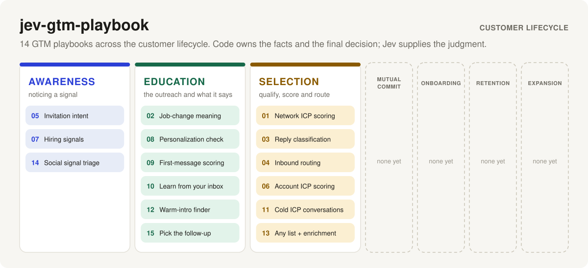
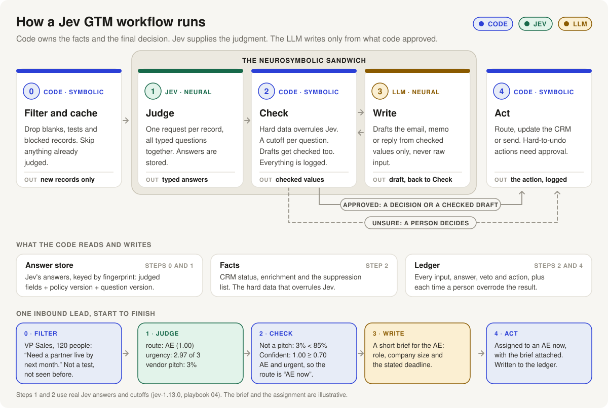

# jev-gtm-playbook



*Go-to-market playbooks built on [TypeSafe's Jev](https://docs.typesafe.ai/introduction): code owns the facts and the final decision, Jev supplies the judgment, an LLM writes only from what code approved, and each playbook runs locally on data you already own.*

| Customer lifecycle stage | AI workflow | What it decides |
|---|---|---|
| Awareness | [05 · Connection-request intent](playbooks-JEv/05-connection-request-intent.md) | Which LinkedIn invitations are buyers, peers or pitches |
| Awareness | [07 · Hiring signals](playbooks-JEv/07-hiring-signals.md) | Which job posts mean a company is building an outbound team |
| Awareness | [14 · Social signal triage](playbooks-JEv/14-social-signal-triage.md) | Engage, monitor or ignore a public post about your problem space |
| Education | [02 · Job-change interpretation](playbooks-JEv/02-job-change-interpretation.md) | Promotion, sideways move or reworded title, whether the new role buys, and a checked draft of the outreach |
| Education | [08 · Personalization fact-check](playbooks-JEv/08-personalization-fact-check.md) | Whether an AI-written line is true, and whether it is too personal |
| Education | [09 · First-message scoring](playbooks-JEv/09-first-message-scoring.md) | Whether a draft is about them, pitchy, templated, or missing an ask |
| Education | [10 · Learn from your own inbox](playbooks-JEv/10-learn-from-inbox.md) | Which opener traits actually get your prospects to reply |
| Education | [12 · Warm-intro finder](playbooks-JEv/12-warm-intro-finder.md) | Who in your network can introduce you to the buyer at a target account |
| Education | [15 · Pick the follow-up](playbooks-JEv/15-pick-the-follow-up.md) | Which of your own follow-up templates fits the thread, or stop |
| Selection | [01 · LinkedIn network ICP scoring](playbooks-JEv/01-linkedin-network-icp.md) | Who in your connections fits your ICP, with customers and competitors excluded by code |
| Selection | [03 · Cold-email reply classification](playbooks-JEv/03-reply-classification.md) | Interested, not now, referral, objection, out of office or unsubscribe, with opt-outs written to the suppression list |
| Selection | [04 · Inbound lead routing](playbooks-JEv/04-inbound-lead-routing.md) | AE, SDR, nurture, vendor pitch or junk, with headcount and customer status overruling the model |
| Selection | [06 · Account ICP scoring](playbooks-JEv/06-account-icp-scoring.md) | Company fit from a description, with exclusions and headcount as hard rules |
| Selection | [11 · Cold ICP conversations](playbooks-JEv/11-cold-icp-conversations.md) | Conversations with buying interest that went quiet, and who owes the reply |
| Selection | [13 · Any lead list + enrichment](playbooks-JEv/13-any-list-and-enrichment.md) | Score any CSV, keep it fresh, and turn enrichment headcounts into facts that overrule the model |
| Mutual Commit | *none yet* | |
| Onboarding | *none yet* | |
| Retention | *none yet* | |
| Expansion | *none yet* | |

The stages run in lifecycle order. All 15 sit on the acquisition side: Awareness (noticing a signal), Education (the outreach and what it says) and Selection (qualifying, scoring and routing). Mutual Commit, Onboarding, Retention and Expansion have no AI workflow yet.

Every AI workflow comes with its request file and real saved Jev answers, so you can replay it without a key: `npm run replay -- 04`. See [the playbooks](playbooks-JEv/README.md).

## The architecture: a neurosymbolic sandwich

**AI in go-to-market fails in two ways.** It acts on a guess, such as emailing someone who opted out or routing an existing customer to sales. Or it writes something untrue. Both come from letting a model own the decision. Here the model never does.



## How Jev fits

Code owns the workflow and the facts. Jev supplies the judgment in the middle. Only the check can release an action.

| Step | What happens | Who does it |
|---|---|---|
| 0. Filter and cache | Drop blanks, tests, blocked and suppressed records. Skip anything already judged. | Code |
| 1. Judge | One request per record, all typed questions together. Answers are stored. | **Jev** |
| 2. Check | Hard data overrules Jev. A cutoff per question. Unsure goes to a person. Everything is logged. | Code |
| 3. Write | Draft the email, memo or reply from checked values only, never raw input. The draft goes back through the check. | LLM, only where the output is prose |
| 4. Act | Route, update or send. Hard-to-undo actions wait for approval. | Code |

Three stores sit underneath: the **answer store** (Jev's answers, by fingerprint), **facts** (CRM status, enrichment and the suppression list), and the **ledger** (every input, answer, veto and action, plus each time a person overrode the result).

### One lead, start to finish

A VP Sales at a 120-person company writes: "Need a partner live by next month."

- **Jev:** route AE at 1.00, urgency 2.97 of 3, vendor pitch 3%.
- **Check:** not a pitch (3% is under 85%), confident (1.00 is over 0.70), AE and urgent. The route is "AE now".

Then change one fact and nothing else:

| What code knows | Result | Why |
|---|---|---|
| Nothing extra | `ae_now` | The check released Jev's answer |
| Enrichment says the company has 6 people | `sdr_review`, a person decides | Hard data overrules the model |
| The company is already a customer | `route_to_csm` | Decided in step 0; Jev was never called |

Jev's answer was the same in all three. The facts were not. Run it yourself: `npm run replay -- 04`.

### Three habits the playbooks share

- **Two narrow questions beat one broad one.** An agency pitching us was only 0.63 sure on the route question, but the separate vendor-pitch question was 93% sure. For job changes, one broad question scored four different cases 73, 42, 64 and 44; the narrow question scored them 77, 34, 73 and 14.
- **Unsure goes to a person.** The post "Is outbound dead in 2026?" came back as "engage" at confidence 0.36. The answer was wrong, the confidence was low, and the cutoff caught it.
- **Not every playbook needs every step.** Ten end at a decision. Two write a draft (02 and 04). Two guard drafts (08 and 09). A workflow with no typed judgment, such as a report or a summary, does not belong here at all.

## Why it stays cheap

- **Free first.** Code drops test strings, blank rows, job seekers, customers, competitors and suppressed contacts. None of that costs a call.
- **Only judge what changed.** Each record gets a fingerprint: the questions, the model and the state Jev sees. If that fingerprint already has a saved answer, no call is made. A daily run on an unchanged list costs nothing.
- **One request per record.** Every question about a record goes in a single call.
- **Shared answers.** In network scoring the person is not part of what Jev sees, so two connections with the same title at the same company share one answer.
- **Cutoffs are applied afterwards.** Jev's raw probabilities are saved. Change a weight or a cutoff in a request file and everything is decided again with no new calls.

Jev bills input tokens only ($0.042 per million at the time of writing; [check current pricing](https://docs.typesafe.ai/models)). A network-scoring request averages about 1,070 input tokens, so 1,000 connections cost around 4.5 cents. The same questions were measured on a real network of 16,711 connections before they moved onto this spine: 16,282 calls, $0.73, 11 minutes, set by the 1,200 requests a minute limit. On this build, all 54 saved cases ran live for $0.0012.

**Why one request per record, and not ten?** Batching several people into one request is faster, but on a 300-row test the likely-buyer probabilities moved by 0.27 on average against 0.03 one at a time, and only 66% of fit scores stayed within 10 points. So single-call is the default.

## What leaves your machine

- **To TypeSafe:** only the `state` of each record, which is the text being judged plus your policy or ICP text. For network scoring that is the job title, the company name and, when enriched, the company description. Names, email addresses and profile links stay in the local database.
- **To the writer model:** only the checked values a playbook lists. The raw form message, reply or thread is never included.
- **Nowhere:** your keys, your facts and the ledger. Details in [SECURITY.md](SECURITY.md).

## Quick start

You need [Node.js](https://nodejs.org) 22.13 or newer. There is nothing to install.

```bash
npm test                 # the whole suite, against real saved Jev answers
npm run replay -- 04     # the lead above, step by step
npm run demo             # network scoring on made-up connections with made-up answers
```

None of the three needs a key.

## Playbook 01: score your own connections

**Find out who in your LinkedIn network fits your ideal customer, and get told when one of them changes jobs.**

Most people have thousands of first-degree connections and no idea which of them could buy what they sell. This playbook scores every connection against your ICP from the one file LinkedIn lets you download. On later imports, code notices who changed jobs and [playbook 02](playbooks-JEv/02-job-change-interpretation.md) interprets each change.

1. **Export your connections from LinkedIn.** Me → Settings & Privacy → Data privacy → Get a copy of your data → choose the larger data archive → Request archive. Full walkthrough: [docs/export-your-connections.md](docs/export-your-connections.md).
2. **Get a TypeSafe key and describe your ICP.** Create a key at [console.typesafe.ai](https://console.typesafe.ai/settings/keys), copy `.env.example` to `.env` and paste it in. Copy `icp.example.json` to `icp.json` and rewrite it in your own words: what you sell, who buys it, who does not, and the groups you sort people into.
3. **Score it.**
   ```bash
   npm run score -- ~/Downloads/Connections.csv
   ```
   Each distinct role is judged once. You get a summary in the terminal and `data/scored-connections.csv`: one row per connection with a 0–100 fit score, persona group and each dimension as a percentage.

Have a lead list rather than your network, or want titles refreshed without re-exporting? See [playbook 13](playbooks-JEv/13-any-list-and-enrichment.md): `npm run score -- your-list.csv`, then `npm run enrich -- prospeo`.

Prefer a UI? `npm start` opens the dashboard on http://localhost:4173, where you can upload the CSV, run it, browse the scored list and work through the signals.

Your first import is the baseline, so it produces fit scores but no signals. **Signals appear from the second import onwards**, when there is something to compare against.

### Running it daily

The dashboard has a daily schedule switch. It only fires while `npm start` is running. If you would rather not leave it running, use your system's scheduler:

```cron
30 7 * * *  cd /path/to/Jev-GTM-playbook && /usr/local/bin/node src/cli.js network >> data/cron.log 2>&1
```

A scheduled run picks up any new CSV in `data/`. If there is no new export, it finds nothing changed and makes no calls.

## Running any other playbook on your own records

1. Copy `.env.example` to `.env` and add `TYPESAFE_API_KEY`. For drafts, also add `OPENROUTER_API_KEY` and `WRITER_MODEL`.
2. Load hard data, if you have any: `node src/cli.js facts facts.json`. The file maps `domain:acme.test` or `email:ada@acme.test` to fields such as `customer`, `open_opportunity`, `competitor`, `target_account`, `employees` and `suppressed`.
3. Put records in a JSON array, each `{ "key", "state", "email"?, "domain"? }`, with `state` shaped like the playbook's cases. [examples/inbound.records.json](examples/inbound.records.json) and [examples/facts.example.json](examples/facts.example.json) show both formats with fictional data.
4. `npm run playbook -- 04 records.json`
5. `node src/cli.js ledger` shows what is waiting for a person. `node src/cli.js approve <id>` releases a checked draft. `node src/cli.js override <id> <action>` records a correction. `node src/cli.js overrides` shows the override rate per playbook; above 5% means rewrite the question or move its cutoff.

## How a playbook is laid out

Each playbook is a page and two JSON files, and both files follow the diagram step by step.

**`playbooks-JEv/requests/NN-name.json`** is the playbook itself:

| Key | Who | What it holds |
|---|---|---|
| `0_filter_and_cache` | code | The rules that decide for free, and how answers are cached |
| `1_judge` | Jev | The typed questions, each tested against real Jev answers |
| `2_check` | code | The facts that overrule Jev, the cutoffs (the code reads these numbers), the rules, and what counts as unsure |
| `3_write` | LLM | What to draft and from which checked values, or `null` when the decision is the output |
| `4_act` | code | What each action does |
| `cases` | | The judgment cases: what Jev says is the point |
| `symbolic_cases` | | The same inputs with different facts: where code decides or overrules |

**`playbooks-JEv/responses/NN-name.json`** holds one trace per case, with the same five keys. `1_judge.response` is the real Jev answer, saved untouched. The other four steps are what the code did with it. `npm test` fails if a saved trace no longer matches the code.

To add a playbook, copy [playbooks-JEv/_template.md](playbooks-JEv/_template.md) and [playbooks-JEv/requests/_template.json](playbooks-JEv/requests/_template.json), then see [CONTRIBUTING.md](CONTRIBUTING.md). Before writing one, run the fit test in [docs/apply-to-other-workflows.md](docs/apply-to-other-workflows.md).

## Tuning

| To change | Edit | Re-runs Jev? |
|---|---|---|
| What you sell, who buys it, your persona groups | `icp.json`. Jev reads this. | Yes |
| A question's wording or criteria | `1_judge.questions` in the request file | Yes, every record |
| The policy text in a record's `state` | Your records | Yes, those records |
| A cutoff, a weight or a size range | `2_check.cutoffs` in the request file | No |
| A rule (which fact overrules what) | `check` in `src/playbooks/NN-name.js` | No |
| What gets dropped for free | `pre` in `src/playbooks/NN-name.js` | No |
| What the LLM is asked to write | `3_write.ask` in the request file | No |

After changing a cutoff or a rule, run `node src/trace.js --write` and `node src/docs.js --write`, then read the diff: every case whose action changed is a decision you are making.

The default cutoffs are starting points, not recommendations. Look at 50 to 100 of your own results, decide which ones you agree with, and move the cutoffs until the list is one you would actually act on.

## What has been measured

**Live Jev, 2026-10-01, `jev-latest`** (run with `node src/compare-live.js`):

- The 13 playbooks that had saved answers ran their own cases live: 54 cases, 51 Jev calls, 28,545 input tokens, $0.0012.
- 53 of 54 gave the same action, status and rule as the saved `jev-1.13.0` answers.
- The one change: playbook 15, "Three unanswered follow-ups". Saved confidence was 0.58, under the 0.6 cutoff, so it went to a person. Live it cleared 0.6 and released `send:breakup`, which is the expected answer. The cutoff sits on top of this case, so tune it on real threads before trusting it.
- Playbook 04 run twice on the same leads: 3 Jev calls, then 0 calls and 3 reused.
- Playbook 01's five cases were asked live (`jev-1.13.0`, about 1,070 input tokens each) and saved as its traces. The enriched description moved the same founder from fit 83 to 98; a 12,000-person headcount in facts brought it back to 83.

**Before Jev and after Jev, playbook 04, 2026-10-01** (run with `node src/compare-before-after.js`):

- 50 fictional labelled leads went through keyword rules only, one LLM prompt only (`anthropic/claude-sonnet-5.5`), and the playbook as built, three times each.
- Correct actions of 50: rules 44, LLM 46, the playbook 41. Costly mistakes: rules 1, LLM 0, the playbook 0.
- The playbook cost $0.023 per 1,000 leads against $2.24 for the LLM, at 0.17 seconds a lead against 2.05.
- Seven of the playbook's ten misses were the 0.7 route cutoff sending a clear lead to a person. One set of 50 supports a statement about that set only.
- [The guide](docs/before-after-jev-guide.md) explains Jev, the three arms and how to run it; [the results](docs/before-after-jev-results.md) list every miss.

**Not measured yet:** drafts. No writer model has been run, so the draft guard has not seen a real draft.

## Honest limits

- **The checks have only been tested on the saved cases.** Jev's answers are real; the facts in the symbolic cases are made up to show each veto firing.
- **Drafts have not been measured.** Whether the per-sentence fact-check suits multi-sentence drafts is unknown.
- **Only playbooks 02 and 04 draft.** Replies to objections, revive messages and post replies need the other person's raw text, which step 3 is not allowed to see.
- **Nothing connects to a CRM or a sender.** Facts load from a JSON file or from enrichment, and actions end in the ledger.
- **Only playbooks 01 and 02 read a CSV.** Every other playbook takes records as JSON; there are no importers for invitations, messages or CRM exports.
- **Network scoring only knows the title and company name.** That is all the LinkedIn export contains. On a real network of 16,711 connections Jev answered "cannot tell" for company fit 71% of the time, which is why `company_fit` has a low weight and an enrichment headcount overrules it.
- **Change detection is only as fresh as your last export.** There is no scraping here, on purpose.
- **Without a key, network scoring uses made-up answers.** They come from keyword matching, are labelled as mock, and are stored separately from real ones.
- **A job change costs two Jev calls.** Playbook 01 scores the person in their new role and playbook 02 interprets the change.
- **The enrichment adapters have not been run against live provider APIs.** Only Prospeo's returns a headcount.
- **The screen for instructions hidden in input is a short phrase list.** It catches only obvious attempts.
- **A probability is not a fact.** Check Jev's answers against cases you know before trusting a cutoff. Jev works best in English.

## Project layout

```
playbooks-JEv/         one page, one request file and one file of saved traces per playbook
docs/                  the architecture diagram, the banner, the export guide
examples/              fictional records, facts and connection exports, in the formats the CLI reads
src/spine.js           the five steps: filter, judge, check, write, act
src/store.js           the three stores: answers, facts, ledger
src/guard.js           the draft guard (playbooks 08 and 09 as functions)
src/playbooks/         one file per playbook: its filter, its check, and its draft or action
src/network.js         snapshots of a list, change detection, and scoring through playbooks 01 and 02
src/csv.js             reads LinkedIn's Connections.csv or any lead list
src/enrich.js          Prospeo, LeadMagic, BlitzAPI and MoltSets adapters; enrichment becomes a snapshot and a fact
src/views.js           what the dashboard and CLI show, decided from stored answers each time
src/server.js          localhost-only dashboard server and daily schedule
src/mock.js            made-up answers for the demo and tests
public/index.html      the dashboard, one file, no build step
src/load.js            reads request files; replays saved Jev answers in place of Jev
src/trace.js           follows each case through the five steps; writes the response files
src/docs.js            writes the playbook pages from the request and response files
src/writer.js          step 3's LLM call, over any OpenAI-compatible endpoint
src/jev.js             the client for POST /v1/systemone, with retries
src/cli.js             commands: replay, run, facts, ledger, approve, override, overrides,
                       demo, score, import, network, status, enrich, serve
```

Run the tests with `npm test`. To contribute, see [CONTRIBUTING.md](CONTRIBUTING.md).

## License and disclaimers

MIT. See [LICENSE](LICENSE).

This project is not made by, affiliated with, endorsed by, or sponsored by LinkedIn or TypeSafe AI. It uses only the data export LinkedIn provides to every member and TypeSafe's public API. You are responsible for how you use other people's information and for following the laws and platform terms that apply to you.
