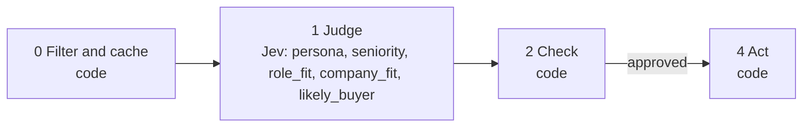

# 01 · LinkedIn network ICP scoring

Most people have thousands of LinkedIn connections and no idea which of them could buy what they sell. This playbook scores every connection in LinkedIn's official Connections.csv export against your ideal customer profile. On later exports, code notices who changed jobs and hands each change to playbook 02.

**Shape:** decision only. Request file: [`requests/01-linkedin-network-icp.json`](requests/01-linkedin-network-icp.json). Saved traces: [`responses/01-linkedin-network-icp.json`](responses/01-linkedin-network-icp.json).

## 0 · Filter and cache (code)

- Skip contacts on the suppression list.
- Send text that looks like an instruction to the model to a person.
- No role and no company listed: skip.
- Title contains a word from skip_if_title_matches: skip.
- Existing customers and competitors are excluded whatever the fit.
- The person is not part of what Jev sees, so two connections with the same title at the same company share one answer.

Answer store. Fingerprint = questions + model + state; a stored answer is reused with no Jev call.

## 1 · Judge (Jev)

One request per record, all questions together.

| Question | Primitive | What it asks |
|---|---|---|
| `persona` | Choice | Which group best describes the role in `connection.current_position`? |
| `seniority` | Score | How senior is the role in `connection.current_position`? |
| `role_fit` | Score | How closely does the role in `connection.current_position` match the buyers described in `ideal_customer.target_roles`, given what is sold in `ideal_customer.what_we_sell`? |
| `company_fit` | Choice | Judging from `connection.current_company` and, if given, `connection.company_description`, does the company match `ideal_customer.target_companies`? |
| `likely_buyer` | Noul | Would the person in this role plausibly take part in deciding whether to buy what is described in `ideal_customer.what_we_sell`? |

## 2 · Check (code)

**Facts that overrule Jev:** `customer`, `competitor`, `employees`.

| Cutoff | Value |
|---|---|
| `weights` | {"role_fit":0.4,"likely_buyer":0.25,"seniority":0.2,"company_fit":0.15} |
| `fit` | 60 |
| `min_employees` | 10 |
| `max_employees` | 500 |

- Fit is a 0 to 100 weighted average of role_fit, likely_buyer, seniority and company_fit.
- When enrichment has a headcount, code compares it to the size range and that replaces Jev's company_fit.
- Weights and the fit cutoff are applied to stored answers, so changing them re-ranks everyone with no Jev call.

**Nothing goes to a person.** Every result is a ranking or a label, not an action on someone.

## 3 · Write (LLM)

Not used. The decision is the output.

## 4 · Act (code)

| Action | What happens |
|---|---|
| `scored` | Ranked list and scored spreadsheet. |
| `excluded` | Left out of the list. |
| `skip` | Nothing. |

Every record is logged with its input, answers, facts, the rule that decided, and the outcome.

## Results

Jev's answers are real, from `jev-1.13.0` on 2026-10-01. Replay them with no key: `npm run replay -- 01`.

**Jev judges.** The cases where the judgment is the point.

| Case | Jev said | Rule that decided | Action | Status |
|---|---|---|---|---|
| Head of sales at a software company | persona: sales_leader (1.00) seniority: 3.00 of 4 role_fit: 3.00 of 3 company_fit: cannot_tell (0.25) likely_buyer: 95% | `weighted_fit` | `scored` | done |
| Engineer | persona: other (1.00) seniority: 1.00 of 4 role_fit: 0.32 of 3 company_fit: cannot_tell (0.53) likely_buyer: 14% | `weighted_fit` | `scored` | done |
| Senior, but not a buyer | persona: other (0.40) seniority: 4.00 of 4 role_fit: 0.51 of 3 company_fit: does_not_fit (0.55) likely_buyer: 28% | `weighted_fit` | `scored` | done |
| Founder at a company whose name says nothing | persona: founder_or_ceo (1.00) seniority: 4.00 of 4 role_fit: 2.99 of 3 company_fit: cannot_tell (0.95) likely_buyer: 92% | `weighted_fit` | `scored` | done |
| The same founder, with an enriched description | persona: founder_or_ceo (1.00) seniority: 4.00 of 4 role_fit: 2.99 of 3 company_fit: fits (0.99) likely_buyer: 91% | `weighted_fit` | `scored` | done |

**Code decides or overrules.** The same inputs with different facts.

| Case | What code knows | Rule that decided | Action | Status |
|---|---|---|---|---|
| Job seeker | `{}` | `title contains "open to work"` | `skip` | filtered |
| Already a customer | `{"domain:thistle.test":{"customer":true},"domain":"thistle.test"}` | `existing_customer` | `excluded` | filtered |
| Works at a competitor | `{"domain:rival.test":{"competitor":true},"domain":"rival.test"}` | `competitor` | `excluded` | filtered |
| Enrichment says 12,000 people | `{"domain:quillfeather.test":{"employees":12000},"domain":"quillfeather.test"}` | `weighted_fit_with_headcount` | `scored` | done |

## What was learned

- Job titles carry the signal and company names mostly do not. That is why company_fit has a low default weight.
- Senior people outside the buying function (VCs, managing partners, CIOs) score high on seniority and low on fit, as they should.
- One request per person, not ten. On a 300-row test, batching 10 people per request moved likely-buyer probabilities by 0.27 on average, against 0.03 one at a time, and only 66% of fit scores stayed within 10 points.
- Measured on a real network: 16,711 connections, 16,282 calls, $0.73, 11.3 minutes (set by the 1,200 requests a minute limit). Re-running the same file: 0 calls.

## Limits

- It only knows the title and company name. On a real network of 16,711 connections Jev answered "cannot tell" for company fit 71% of the time, which is why company_fit has a low weight and enrichment overrules it.
- Change detection is only as fresh as your last export. There is no scraping, on purpose.
- Only job title, company name, company description and your ICP text reach Jev. Names, emails and profile links stay local.
