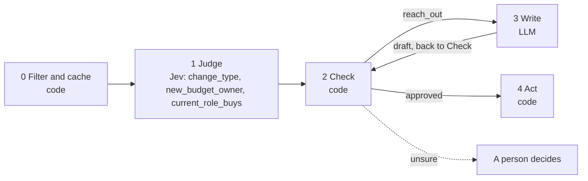

# 02 · Job-change interpretation

A job change is the best reason to get back in touch, but most "changes" in an export are noise: a reworded title, or a promotion inside a function that never buys from you. Code notices that a title changed. Jev decides what the change means. Code decides what to do about it.

**Shape:** decision, then a draft. Request file: [`requests/02-job-change-interpretation.json`](requests/02-job-change-interpretation.json). Saved traces: [`responses/02-job-change-interpretation.json`](responses/02-job-change-interpretation.json).

## 0 · Filter and cache (code)

- Skip contacts on the suppression list.
- Send text that looks like an instruction to the model to a person.
- Same title and company after normalising case and spacing: no change, ignore.

Answer store. Fingerprint = questions + model + state; a stored answer is reused with no Jev call.

## 1 · Judge (Jev)

One request per record, all questions together.

| Question | Primitive | What it asks |
|---|---|---|
| `change_type` | Choice | Compare the role in `previous` with the role in `current`. What kind of change is this? |
| `new_budget_owner` | Noul | Does the role in `current` own a budget for `what_we_sell` that the role in `previous` did not? |
| `current_role_buys` | Noul | Is the role in `current` one whose holder decides whether to buy `what_we_sell`? |

## 2 · Check (code)

**Facts that overrule Jev:** `customer`, `open_opportunity`, `fit`.

| Cutoff | Value |
|---|---|
| `change_type_confidence` | 0.6 |
| `current_role_buys` | 0.6 |
| `new_budget_owner` | 0.5 |
| `min_fit` | 60 |

- Account is a customer or has an open opportunity: route to the account owner, not outreach.
- change_type is same_job_reworded: ignore.
- current_role_buys below the cutoff: ignore.
- A fit score below min_fit, from playbook 01 or 06: ignore. A missing fit score does not filter.
- Otherwise reach out; new_budget_owner at or above its cutoff marks "just gained the budget".

**Goes to a person when:**

- change_type confidence below the cutoff.

## 3 · Write (LLM)

Only when the check releases `reach_out`.

- **Asked to write:** Write a two-sentence LinkedIn message to this person about their new role. End with one easy question about the role.
- **From these checked values only:** `previous_role`, `new_role`, `company`, `change`, `just_gained_budget`
- **The draft goes back through:** 08 fact-check, per sentence; 09 message score
- **Drafts allowed:** 2, then a person takes it. A draft that passes waits for approval.

## 4 · Act (code)

| Action | What happens |
|---|---|
| `reach_out` | Draft waits for approval; a person sends it. |
| `route_to_owner` | Hand to the account owner. |
| `ignore` | Nothing. |
| `review` | A person decides. |

Every record is logged with its input, answers, facts, the rule that decided, and the outcome.

## Results

Jev's answers are real, from `jev-1.13.0` on 2026-09-22. Replay them with no key: `npm run replay -- 02`.

**Jev judges.** The cases where the judgment is the point.

| Case | Jev said | Rule that decided | Action | Status |
|---|---|---|---|---|
| Promoted into the buying seat | change_type: moved_up (1.00) new_budget_owner: 64% current_role_buys: 77% | `current_role_buys` | `reach_out` | needs_person |
| Title reworded, same job | change_type: same_job_reworded (0.90) new_budget_owner: 19% current_role_buys: 34% | `same_job_reworded` | `ignore` | done |
| Left to start a company | change_type: moved_up (1.00) new_budget_owner: 70% current_role_buys: 73% | `current_role_buys` | `reach_out` | needs_person |
| Senior, but into a non-buying function | change_type: moved_up (1.00) new_budget_owner: 37% current_role_buys: 14% | `role_does_not_buy` | `ignore` | done |

**Code decides or overrules.** The same inputs with different facts.

| Case | What code knows | Rule that decided | Action | Status |
|---|---|---|---|---|
| Open opportunity on the account | `{"domain:brightloop.test":{"open_opportunity":true},"domain":"brightloop.test"}` | `existing_account` | `route_to_owner` | done |
| Same title after normalising | `{}` | `no_change` | `ignore` | filtered |
| Promoted, but a poor fit | `{"fit":30}` | `low_fit` | `ignore` | done |

## What was learned

- The first version asked one broad question, "is this move a good reason to get in touch now?". It could barely tell the cases apart: 73%, 42%, 64% and 44%. Replacing it with the narrow "does the current role buy this?" separated them: 77%, 34%, 73% and 14%. When a question gives mushy probabilities, split it.
- The old and new roles go into the state together as named fields, so Jev judges the relationship between them.
- Use new_budget_owner to order the reach-out list: someone who just gained the budget is a warmer conversation.

## Limits

- Titles are all there is to go on. "Director" can mean a team of 2 or 200.
- Senior but in the wrong function is the case to watch. Check the cutoffs against people you know.
