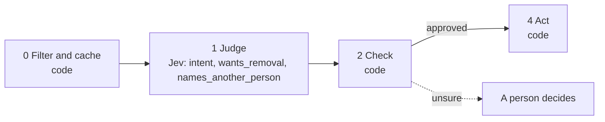

# 03 · Cold-email reply classification

Every outbound team triages replies: book the interested ones, snooze the not-nows, follow the referrals, and never email the opt-outs again. The costly mistake is treating a polite "please take me off your list" as a plain "no thanks". Removal is asked as its own question so no intent can override it.

**Shape:** decision only. Request file: [`requests/03-reply-classification.json`](requests/03-reply-classification.json). Saved traces: [`responses/03-reply-classification.json`](responses/03-reply-classification.json).

## 0 · Filter and cache (code)

- Skip contacts on the suppression list.
- Send text that looks like an instruction to the model to a person.
- Reply contains "unsubscribe", "remove me" or "opt out": suppress without asking Jev.

Answer store. Fingerprint = questions + model + state; a stored answer is reused with no Jev call.

## 1 · Judge (Jev)

One request per record, all questions together.

| Question | Primitive | What it asks |
|---|---|---|
| `intent` | Choice | What is the sender of `reply` telling us, in response to the cold email in `our_email`? |
| `wants_removal` | Noul | Does `reply` ask, in any wording, to stop being contacted or to be removed from the list? |
| `names_another_person` | Noul | Does `reply` name or point to a different person we should contact instead? |

## 2 · Check (code)

**Facts that overrule Jev:** `customer`, `suppressed`.

| Cutoff | Value |
|---|---|
| `wants_removal` | 0.5 |
| `intent_confidence` | 0.7 |
| `names_another_person` | 0.8 |
| `snooze_days` | 90 |

- wants_removal at or above the cutoff suppresses, whatever the intent.
- A customer asking for removal goes to the account owner instead of silently onto the list.
- Referral: a regex copies the address from the reply; Jev only decides that a referral exists.
- Otherwise act on intent: interested books, not_now snoozes, out_of_office retries, the rest close.

**Goes to a person when:**

- intent confidence below the cutoff.
- An objection.
- A referral with no address in the reply.
- A customer asking to be removed.

## 3 · Write (LLM)

Not used. The decision is the output.

## 4 · Act (code)

| Action | What happens |
|---|---|
| `suppress` | Write suppressed = true to the facts for that email. Every playbook reads it in step 0. |
| `book_meeting` | Book. |
| `snooze` | Snooze for snooze_days. |
| `extract_contact` | Push the referred contact to the SDR queue. |
| `retry_later` | Retry after the out-of-office. |
| `close` | Close the thread. |

Every record is logged with its input, answers, facts, the rule that decided, and the outcome.

## Results

Jev's answers are real, from `jev-1.13.0` on 2026-09-22. Replay them with no key: `npm run replay -- 03`.

**Jev judges.** The cases where the judgment is the point.

| Case | Jev said | Rule that decided | Action | Status |
|---|---|---|---|---|
| Interested, asks for times | intent: interested (0.99) wants_removal: 1% names_another_person: 7% | `intent` | `book_meeting` | done |
| Polite no that is really an opt-out | intent: unsubscribe (1.00) wants_removal: 99% names_another_person: 2% | `wants_removal` | `suppress` | done |
| Referral | intent: referral (1.00) wants_removal: 2% names_another_person: 98% | `intent` | `extract_contact` | done |
| Out of office that mentions a return date | intent: out_of_office (1.00) wants_removal: 2% names_another_person: 69% | `intent` | `retry_later` | done |
| Not now, circle back | intent: not_now (0.99) wants_removal: 6% names_another_person: 4% | `intent` | `snooze` | done |

**Code decides or overrules.** The same inputs with different facts.

| Case | What code knows | Rule that decided | Action | Status |
|---|---|---|---|---|
| Blunt unsubscribe | `{"email":"blunt@example.com"}` | `regex_unsubscribe` | `suppress` | filtered |
| Customer asks to be removed | `{"email:vip@example.com":{"customer":true},"email":"vip@example.com"}` | `customer_asked_removal` | `stop_and_alert_owner` | needs_person |
| Already on the suppression list | `{"email:gone@example.com":{"suppressed":true},"email":"gone@example.com"}` | `suppressed` | `skip` | filtered |

## What was learned

- Removal and referral are separate Nouls because you act on them whatever the intent is.
- Only use a secondary answer on the branch it belongs to. The out-of-office reply names another address at 69%, but it is a support inbox, not a referral; names_another_person is read only when the intent is referral.
- Get the address with a regex, not the model. Jev decides whether a referral exists; code copies it.

## Limits

- Keep the removal cutoff low. Wrongly suppressing someone costs a reply; emailing an opt-out costs sender reputation and possibly a legal complaint.
- Test on your own inbox, including replies in other languages. Jev is strongest in English.
- Objections go to a person. Drafting a reply to one needs the raw reply text, which step 3 is not allowed to see.
