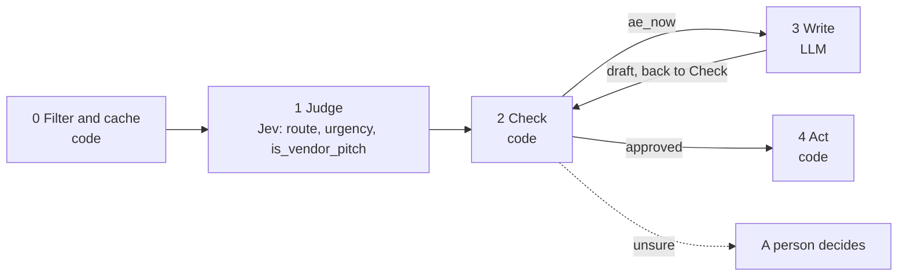

# 04 · Inbound lead routing

Form fills arrive mixed together: real buyers, students, agencies pitching you, and "test test". Sending all of them to an AE wastes the AE's time; sending a real buyer to nurture loses the deal. This is the lead followed through the architecture diagram.

**Shape:** decision, then a draft. Request file: [`requests/04-inbound-lead-routing.json`](requests/04-inbound-lead-routing.json). Saved traces: [`responses/04-inbound-lead-routing.json`](responses/04-inbound-lead-routing.json).

## 0 · Filter and cache (code)

- Skip contacts on the suppression list.
- Send text that looks like an instruction to the model to a person.
- Message is only a test string ("test", "asdf", "qwerty"): discard.
- Existing customer: route to their CSM, not sales.

Answer store. Fingerprint = questions + model + state; a stored answer is reused with no Jev call.

## 1 · Judge (Jev)

One request per record, all questions together.

| Question | Primitive | What it asks |
|---|---|---|
| `route` | Choice | Given the form submission in `lead` and the routing rules in `routing_policy`, where should this lead go? |
| `urgency` | Score | How soon does the person in `lead` need a solution, based on what they wrote? |
| `is_vendor_pitch` | Noul | Is the person in `lead` trying to sell something to us rather than buy from us? |

## 2 · Check (code)

**Facts that overrule Jev:** `customer`, `employees`.

| Cutoff | Value |
|---|---|
| `min_employees` | 10 |
| `is_vendor_pitch` | 0.85 |
| `junk_confidence` | 0.9 |
| `route_confidence` | 0.7 |
| `urgency` | 2 |

- Enrichment headcount below min_employees overrules an account_executive route.
- is_vendor_pitch at or above the cutoff goes to the partner inbox, whatever route says.
- junk at or above junk_confidence is discarded.
- account_executive with urgency at or above the cutoff is "AE now".
- Otherwise follow route.

**Goes to a person when:**

- route confidence below the cutoff.
- Headcount contradicts the route.

## 3 · Write (LLM)

Only when the check releases `ae_now`.

- **Asked to write:** Write a two-sentence brief for the account executive taking this lead: who they are, and how soon they need help.
- **From these checked values only:** `role`, `employees`, `urgency`
- **The draft goes back through:** 08 fact-check, per sentence
- **Drafts allowed:** 2, then a person takes it. A draft that passes waits for approval.

## 4 · Act (code)

| Action | What happens |
|---|---|
| `ae_now` | Brief waits for approval, then the lead is assigned to an AE. |
| `partner_inbox` | Move to the partner inbox. |
| `sdr_review` | A person decides. |
| `route_to_csm` | Hand to the CSM. |
| `discard` | Drop. |
| `nurture` | Enrol in nurture. |
| `sdr_qualify` | SDR queue. |

Every record is logged with its input, answers, facts, the rule that decided, and the outcome.

## Results

Jev's answers are real, from `jev-1.13.0` on 2026-09-22. Replay them with no key: `npm run replay -- 04`.

**Jev judges.** The cases where the judgment is the point.

| Case | Jev said | Rule that decided | Action | Status |
|---|---|---|---|---|
| Qualified and urgent | route: account_executive (1.00) urgency: 2.97 of 3 is_vendor_pitch: 3% | `ae_and_urgent` | `ae_now` | needs_person |
| Agency pitching us | route: partner_or_vendor (0.63) urgency: 0.20 of 3 is_vendor_pitch: 93% | `is_vendor_pitch` | `partner_inbox` | done |
| Vague early research | route: nurture (0.50) urgency: 0.92 of 3 is_vendor_pitch: 3% | `low_confidence` | `sdr_review` | needs_person |
| Junk | not asked | `test_string` | `discard` | filtered |

**Code decides or overrules.** The same inputs with different facts.

| Case | What code knows | Rule that decided | Action | Status |
|---|---|---|---|---|
| Enrichment says 6 people | `{"domain:tiny.test":{"employees":6},"domain":"tiny.test"}` | `headcount_below_minimum` | `sdr_review` | needs_person |
| Existing customer fills in the form | `{"domain:client.test":{"customer":true},"domain":"client.test"}` | `existing_customer` | `route_to_csm` | filtered |

## What was learned

- The two low-confidence answers are the interesting ones. The vague lead split between nurture and SDR, which is a real judgment call, so a person makes it.
- The agency pitch was only 0.63 confident on route, but the separate is_vendor_pitch question was 93% sure. Two questions that agree are a stronger signal than one.

## Limits

- The routing policy is the product. Write it the way you would brief a new SDR, and re-test when it changes.
- Company size and role come from the form. The headcount veto only works when enrichment has loaded a number into facts.
