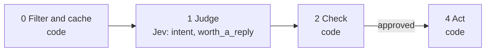

# 05 · Connection-request intent

LinkedIn's data export includes every pending connection request with its message. Most incoming messages are pitches, but a few are buyers describing their problem in the first line. This playbook finds those.

**Shape:** decision only. Request file: [`requests/05-connection-request-intent.json`](requests/05-connection-request-intent.json). Saved traces: [`responses/05-connection-request-intent.json`](responses/05-connection-request-intent.json).

## 0 · Filter and cache (code)

- Skip contacts on the suppression list.
- Send text that looks like an instruction to the model to a person.
- Only incoming invitations.
- Only invitations with a message.
- A target account goes to the top without asking Jev.

Answer store. Fingerprint = questions + model + state; a stored answer is reused with no Jev call.

## 1 · Judge (Jev)

One request per record, all questions together.

| Question | Primitive | What it asks |
|---|---|---|
| `intent` | Choice | What does the sender of `invitation_message` want from us? |
| `worth_a_reply` | Noul | Given `what_we_sell`, is `invitation_message` worth a personal reply? |

## 2 · Check (code)

**Facts that overrule Jev:** `target_account`.

| Cutoff | Value |
|---|---|
| `intent_confidence` | 0.7 |

- potential_buyer at or above the confidence cutoff: reply, ranked by worth_a_reply.
- Everything else: ignore.

**Nothing goes to a person.** Every result is a ranking or a label, not an action on someone.

## 3 · Write (LLM)

Not used. The decision is the output.

## 4 · Act (code)

| Action | What happens |
|---|---|
| `reply` | Top of the inbox. |
| `ignore` | Nothing. |
| `skip` | Nothing. |

Every record is logged with its input, answers, facts, the rule that decided, and the outcome.

## Results

Jev's answers are real, from `jev-1.13.0` on 2026-09-22. Replay them with no key: `npm run replay -- 05`.

**Jev judges.** The cases where the judgment is the point.

| Case | Jev said | Rule that decided | Action | Status |
|---|---|---|---|---|
| Buyer hiding in an invite | intent: potential_buyer (0.94) worth_a_reply: 56% | `potential_buyer` | `reply` | done |
| Pitch | intent: pitching_us (0.95) worth_a_reply: 9% | `intent_pitching_us` | `ignore` | done |
| Peer from an event | intent: peer_or_community (0.55) worth_a_reply: 52% | `intent_peer_or_community` | `ignore` | done |
| No real content | intent: unclear (0.47) worth_a_reply: 15% | `intent_unclear` | `ignore` | done |

**Code decides or overrules.** The same inputs with different facts.

| Case | What code knows | Rule that decided | Action | Status |
|---|---|---|---|---|
| From a target account | `{"domain:target.test":{"target_account":true},"domain":"target.test"}` | `target_account` | `reply` | filtered |
| An invitation we sent | `{"direction":"OUTGOING"}` | `not_incoming` | `skip` | filtered |

## What was learned

- The unclear option matters. Without a no-match option the model has to force a short "let's connect" into a real category.
- Code first paid off on one real account: only 125 of 5,650 invitation rows had an incoming message, about half a cent in total.
- When someone accepts, they appear in the next Connections.csv and playbook 01 scores them.

## Limits

- The export has no title or company for invitations. Only the message can be judged.
- Pitches are often written to sound like buyers. Review before replying.
