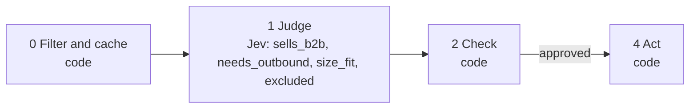

# 06 · Account ICP scoring

"Is this company a good fit?" is several questions in one: do they sell to businesses, do they depend on outbound, are they the right size, are they excluded? Each is asked separately and combined in code, so a competitor that scores perfectly on everything else is still caught.

**Shape:** decision only. Request file: [`requests/06-account-icp-scoring.json`](requests/06-account-icp-scoring.json). Saved traces: [`responses/06-account-icp-scoring.json`](responses/06-account-icp-scoring.json).

## 0 · Filter and cache (code)

- Skip contacts on the suppression list.
- Send text that looks like an instruction to the model to a person.
- Existing customer: skip.
- Domain on the competitor or exclusion list: excluded.

Answer store. Fingerprint = questions + model + state; a stored answer is reused with no Jev call.

## 1 · Judge (Jev)

One request per record, all questions together.

| Question | Primitive | What it asks |
|---|---|---|
| `sells_b2b` | Score | How clearly does `company.description` show that this company sells to other businesses? |
| `needs_outbound` | Score | How much does the business in `company.description` depend on a sales team reaching new customers directly? |
| `size_fit` | Choice | Using `company.employees`, where does this company fall relative to `target_size`? |
| `excluded` | Noul | Does the company in `company` match any of the exclusions in `exclusions`? |

## 2 · Check (code)

**Facts that overrule Jev:** `customer`, `competitor`, `excluded`, `employees`.

| Cutoff | Value |
|---|---|
| `excluded` | 0.5 |
| `size_fit_confidence` | 0.8 |
| `min_employees` | 10 |
| `max_employees` | 500 |
| `weights` | {"sells_b2b":0.4,"needs_outbound":0.6} |

- excluded at or above the cutoff: fit 0.
- When a headcount number exists, code compares it to the range and ignores size_fit.
- With no number, size_fit outside the range at or above its confidence cutoff: fit 0.
- Otherwise fit = weighted average of sells_b2b and needs_outbound, 0 to 100.

**Nothing goes to a person.** Every result is a ranking or a label, not an action on someone.

## 3 · Write (LLM)

Not used. The decision is the output.

## 4 · Act (code)

| Action | What happens |
|---|---|
| `scored` | Write account_fit to the facts for that domain. Playbook 07 reads it in step 0. |
| `excluded` | Nothing. |
| `skip` | Nothing. |

Every record is logged with its input, answers, facts, the rule that decided, and the outcome.

## Results

Jev's answers are real, from `jev-1.13.0` on 2026-09-22. Replay them with no key: `npm run replay -- 06`.

**Jev judges.** The cases where the judgment is the point.

| Case | Jev said | Rule that decided | Action | Status |
|---|---|---|---|---|
| Vertical SaaS selling to clinics | sells_b2b: 3.00 of 3 needs_outbound: 2.66 of 3 size_fit: in_range (1.00) excluded: 5% | `weighted_fit` | `scored` | done |
| Consumer app | sells_b2b: 0.00 of 3 needs_outbound: 0.00 of 3 size_fit: in_range (0.95) excluded: 5% | `weighted_fit` | `scored` | done |
| A competitor | sells_b2b: 3.00 of 3 needs_outbound: 2.98 of 3 size_fit: in_range (0.94) excluded: 72% | `excluded` | `scored` | done |
| Enterprise, too large | sells_b2b: 3.00 of 3 needs_outbound: 2.91 of 3 size_fit: too_large (1.00) excluded: 5% | `headcount_out_of_range` | `scored` | done |

**Code decides or overrules.** The same inputs with different facts.

| Case | What code knows | Rule that decided | Action | Status |
|---|---|---|---|---|
| Enrichment says 4,000 people | `{"domain:big.test":{"employees":4000},"domain":"big.test"}` | `headcount_out_of_range` | `scored` | done |
| On the competitor list | `{"domain:rival.test":{"competitor":true},"domain":"rival.test"}` | `exclusion_list` | `excluded` | filtered |

## What was learned

- The competitor is the case composite scoring exists for: a perfect fit on every dimension, caught only by the separate exclusion question.
- Each Score level describes a concrete situation, not a degree. "Moderately B2B" gives Jev nothing to match against.
- Weighted averages suit preferences that can make up for each other. "Any serious violation" rules need their own check first.

## Limits

- The description does all the work. Pull it from the company's website or an enrichment provider; a bare company name is not enough.
- The size range is a pair of numbers in `2_check.cutoffs`. Keep it in step with the `target_size` text Jev reads.
