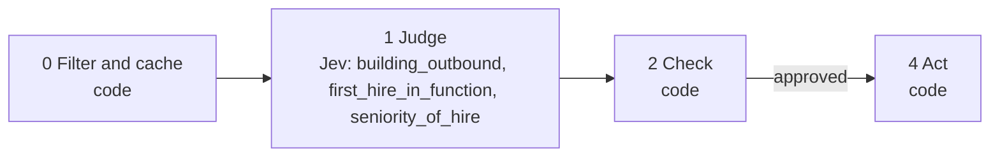

# 07 · Hiring signals

A company posting a job for its first SDR, or a head of sales development, is about to invest in outbound. Keywords misread these posts: "Account Manager" contains "account". Jev is asked what the role actually does.

**Shape:** decision only. Request file: [`requests/07-hiring-signals.json`](requests/07-hiring-signals.json). Saved traces: [`responses/07-hiring-signals.json`](responses/07-hiring-signals.json).

## 0 · Filter and cache (code)

- Skip contacts on the suppression list.
- Send text that looks like an instruction to the model to a person.
- Account scored below min_account_fit by playbook 06: skip. Unscored accounts pass.
- The same post text is never judged twice (the answer store).

Answer store. Fingerprint = questions + model + state; a stored answer is reused with no Jev call.

## 1 · Judge (Jev)

One request per record, all questions together.

| Question | Primitive | What it asks |
|---|---|---|
| `building_outbound` | Noul | Does `job_post` show the company is building or rebuilding a team whose job is to contact prospective customers directly? |
| `first_hire_in_function` | Noul | Does `job_post` suggest this is one of the first hires in this function at the company? |
| `seniority_of_hire` | Choice | What level is the role in `job_post`? |

## 2 · Check (code)

**Facts that overrule Jev:** `account_fit`.

| Cutoff | Value |
|---|---|
| `min_account_fit` | 60 |
| `building_outbound` | 0.8 |
| `first_hire_in_function` | 0.8 |

- building_outbound below the cutoff: no signal.
- Strong when first_hire_in_function clears its cutoff or the hire is not an individual contributor; otherwise normal.
- "First hire" stays a hint: it is read from the wording of the post.

**Nothing goes to a person.** Every result is a ranking or a label, not an action on someone.

## 3 · Write (LLM)

Not used. The decision is the output.

## 4 · Act (code)

| Action | What happens |
|---|---|
| `signal_strong` | Flag the account. |
| `signal_normal` | Note on the account. |
| `no_signal` | Nothing. |
| `skip` | Nothing. |

Every record is logged with its input, answers, facts, the rule that decided, and the outcome.

## Results

Jev's answers are real, from `jev-1.13.0` on 2026-09-22. Replay them with no key: `npm run replay -- 07`.

**Jev judges.** The cases where the judgment is the point.

| Case | Jev said | Rule that decided | Action | Status |
|---|---|---|---|---|
| First SDR hire | building_outbound: 97% first_hire_in_function: 97% seniority_of_hire: individual_contributor (1.00) | `building_outbound` | `signal_strong` | done |
| Account manager (existing customers) | building_outbound: 2% first_hire_in_function: 22% seniority_of_hire: individual_contributor (0.86) | `not_building_outbound` | `no_signal` | done |
| Head of Sales Development | building_outbound: 98% first_hire_in_function: 93% seniority_of_hire: director_or_vp (0.62) | `building_outbound` | `signal_strong` | done |
| Engineer | building_outbound: 1% first_hire_in_function: 24% seniority_of_hire: individual_contributor (1.00) | `not_building_outbound` | `no_signal` | done |

**Code decides or overrules.** The same inputs with different facts.

| Case | What code knows | Rule that decided | Action | Status |
|---|---|---|---|---|
| Post from an account that scored 20 | `{"domain:unfit.test":{"account_fit":20},"domain":"unfit.test"}` | `account_not_a_fit` | `skip` | filtered |

## What was learned

- The Account Manager post is the one a keyword filter gets wrong. Jev put it at 2%.
- A job post costs about 470 input tokens, so 100,000 posts cost about $2. That makes it practical to watch every account in a market.

## Limits

- "First hire" is inferred from the wording of the post. Treat it as a hint, not a fact.
- Recruiter reposts and evergreen listings look like new signals. Remove duplicates by company and title before building records.
