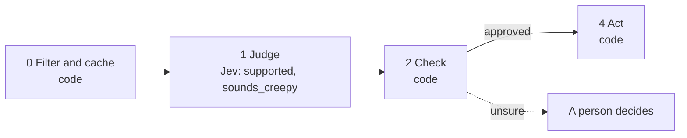

# 08 · Personalization fact-check

AI-written first lines are sometimes made up, and sometimes true but too personal. This playbook is the guard between the LLM that writes and the send button. The spine runs it on every sentence of every draft; it is also a playbook of its own so its cutoffs can be replayed and tuned.

**Shape:** guard on a draft. Request file: [`requests/08-personalization-fact-check.json`](requests/08-personalization-fact-check.json). Saved traces: [`responses/08-personalization-fact-check.json`](responses/08-personalization-fact-check.json).

## 0 · Filter and cache (code)

- Skip contacts on the suppression list.
- Send text that looks like an instruction to the model to a person.

Answer store. Fingerprint = questions + model + state; a stored answer is reused with no Jev call.

## 1 · Judge (Jev)

One request per record, all questions together.

| Question | Primitive | What it asks |
|---|---|---|
| `supported` | Choice | Do the facts that `first_line` relies on appear in `source`? Ignore greetings and well-wishes; judge only the factual claim. |
| `sounds_creepy` | Noul | Does `first_line` bring up the recipient's private life? |

## 2 · Check (code)

**Facts that overrule Jev:** none. This playbook checks cutoffs only.

| Cutoff | Value |
|---|---|
| `sounds_creepy` | 0.5 |
| `supported_confidence` | 0.8 |

- sounds_creepy at or above the cutoff: rewrite, too personal.
- supported at or above its confidence cutoff: send.
- contradicted: rewrite, wrong fact.

**Goes to a person when:**

- unsupported, or supported below the confidence cutoff.

## 3 · Write (LLM)

Not used. The decision is the output.

## 4 · Act (code)

| Action | What happens |
|---|---|
| `send` | The line may be used. |
| `rewrite` | Back to the writer with the problem named. |
| `human_review` | A person decides. |

Every record is logged with its input, answers, facts, the rule that decided, and the outcome.

## Results

Jev's answers are real, from `jev-1.13.0` on 2026-09-22. Replay them with no key: `npm run replay -- 08`.

**Jev judges.** The cases where the judgment is the point.

| Case | Jev said | Rule that decided | Action | Status |
|---|---|---|---|---|
| Accurate | supported: supported (0.99) sounds_creepy: 1% | `supported` | `send` | done |
| Invented detail | supported: unsupported (1.00) sounds_creepy: 2% | `unsupported_or_unsure` | `human_review` | needs_person |
| Contradicted | supported: contradicted (0.77) sounds_creepy: 2% | `wrong_fact` | `rewrite` | done |
| True but personal | supported: supported (0.80) sounds_creepy: 98% | `too_personal` | `rewrite` | done |

## What was learned

- The first draft asked whether the line "would feel intrusive" and scored the surgery line at only 26%. It also called the line unsupported, because "hope it's going well" is not in the source.
- Two fixes: tell the fact check to ignore greetings and well-wishes and judge only the factual claim, and give the privacy question concrete criteria (health, family, children, relationships, even if shared publicly). The 26% became 98%.
- Vague criteria give vague probabilities.

## Limits

- It can only check against the source it is given.
- "Contradicted" came back at 0.77, lower than the others. Keep a person in the loop until the cutoff is checked on your own sends.
- It was tested on single lines. Checking each sentence of a longer draft has not been measured live.
