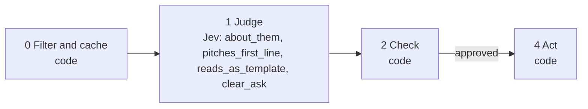

# 09 · First-message scoring

Most outbound campaigns fail in the first message, not the list. This playbook scores a draft on the four things that decide whether someone replies. The spine runs it on every draft addressed to a prospect.

**Shape:** guard on a draft. Request file: [`requests/09-first-message-scoring.json`](requests/09-first-message-scoring.json). Saved traces: [`responses/09-first-message-scoring.json`](responses/09-first-message-scoring.json).

## 0 · Filter and cache (code)

- Skip contacts on the suppression list.
- Send text that looks like an instruction to the model to a person.
- Unfilled {placeholder}: rewrite without asking Jev.
- Longer than max_chars: rewrite without asking Jev.

Answer store. Fingerprint = questions + model + state; a stored answer is reused with no Jev call.

## 1 · Judge (Jev)

One request per record, all questions together.

| Question | Primitive | What it asks |
|---|---|---|
| `about_them` | Score | How much is `message` about `prospect` and their situation, rather than about the sender? |
| `pitches_first_line` | Noul | Does the first sentence of `message` pitch a product, service or meeting? |
| `reads_as_template` | Noul | Would `prospect` recognise `message` as a mass template sent to many people? |
| `clear_ask` | Noul | Does `message` end with one clear, low-effort question or request? |

## 2 · Check (code)

**Facts that overrule Jev:** none. This playbook checks cutoffs only.

| Cutoff | Value |
|---|---|
| `about_them` | 2 |
| `pitches_first_line` | 0.5 |
| `reads_as_template` | 0.7 |
| `clear_ask` | 0.5 |
| `max_chars` | 600 |

- about_them below the cutoff: make it about them.
- pitches_first_line at or above the cutoff: do not pitch in line one.
- reads_as_template at or above the cutoff: reads like a template.
- clear_ask below the cutoff: end with one easy question.
- No problems: send.

**Nothing goes to a person.** Every result is a ranking or a label, not an action on someone.

## 3 · Write (LLM)

Not used. The decision is the output.

## 4 · Act (code)

| Action | What happens |
|---|---|
| `send` | The message may be sent. |
| `rewrite` | Back to the writer with the list of problems. |

Every record is logged with its input, answers, facts, the rule that decided, and the outcome.

## Results

Jev's answers are real, from `jev-1.13.0` on 2026-09-22. Replay them with no key: `npm run replay -- 09`.

**Jev judges.** The cases where the judgment is the point.

| Case | Jev said | Rule that decided | Action | Status |
|---|---|---|---|---|
| Pitch-first template | not asked | `unfilled placeholder` | `rewrite` | filtered |
| Specific and short | about_them: 2.99 of 3 pitches_first_line: 3% reads_as_template: 36% clear_ask: 82% | `no_problems` | `send` | done |
| Flattery then pitch | about_them: 1.53 of 3 pitches_first_line: 7% reads_as_template: 86% clear_ask: 94% | `make it about them; reads like a template` | `rewrite` | done |
| Specific but rambling, no ask | about_them: 2.46 of 3 pitches_first_line: 4% reads_as_template: 75% clear_ask: 3% | `reads like a template; end with one easy question` | `rewrite` | done |

## What was learned

- These are four separate questions for a reason. The flattery-then-pitch draft opens with flattery, not a pitch (7%), so a single "is this pitchy?" check would pass it. reads_as_template catches it at 86%.
- To choose between variants, score each one for each prospect and send the one with the fewest problems. Four variants for 1,000 prospects is 4,000 calls, about $0.10.

## Limits

- It judges the message, not the offer. A well-written message to the wrong person still fails.
- "Template" is a matter of taste at the margins. Set the cutoff on your own messages.
