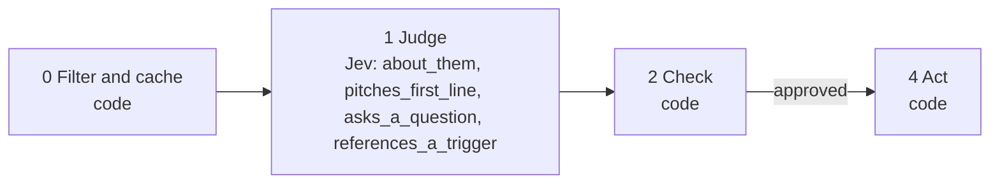

# 10 · Learn from your own inbox

Your inbox knows which openers work for your prospects. Code labels each of your first messages replied or not. Jev describes each opener. Code then measures which traits go with a reply.

**Shape:** decision only. Request file: [`requests/10-learn-from-inbox.json`](requests/10-learn-from-inbox.json). Saved traces: [`responses/10-learn-from-inbox.json`](responses/10-learn-from-inbox.json).

## 0 · Filter and cache (code)

- Skip contacts on the suppression list.
- Send text that looks like an instruction to the model to a person.
- Code groups messages into threads, takes your opener and labels it replied or not. That label never comes from Jev.

Answer store. Fingerprint = questions + model + state; a stored answer is reused with no Jev call.

## 1 · Judge (Jev)

One request per record, all questions together.

| Question | Primitive | What it asks |
|---|---|---|
| `about_them` | Score | How much is `opener` about the recipient and their situation, rather than about the sender? |
| `pitches_first_line` | Noul | Does the first sentence of `opener` pitch a product, service or meeting? |
| `asks_a_question` | Noul | Does `opener` ask the recipient a genuine question about their situation? |
| `references_a_trigger` | Noul | Does `opener` mention a specific recent event about the recipient, such as a new role, a post, a hire or a launch? |

## 2 · Check (code)

**Facts that overrule Jev:** none. This playbook checks cutoffs only.

| Cutoff | Value |
|---|---|
| `trait` | 0.5 |
| `min_sample` | 20 |

- Jev describes each opener; code computes the reply rate with and without each trait.
- A group smaller than min_sample reports no rate.

**Nothing goes to a person.** Every result is a ranking or a label, not an action on someone.

## 3 · Write (LLM)

Not used. The decision is the output.

## 4 · Act (code)

| Action | What happens |
|---|---|
| `described` | The traits are kept for the reply-rate report. |

Every record is logged with its input, answers, facts, the rule that decided, and the outcome.

## Results

Jev's answers are real, from `jev-1.13.0` on 2026-09-22. Replay them with no key: `npm run replay -- 10`.

**Jev judges.** The cases where the judgment is the point.

| Case | Jev said | Rule that decided | Action | Status |
|---|---|---|---|---|
| Opener A (got a reply) | about_them: 2.99 of 3 pitches_first_line: 3% asks_a_question: 87% references_a_trigger: 98% | `described` | `described` | done |
| Opener B (no reply) | about_them: 0.56 of 3 pitches_first_line: 95% asks_a_question: 7% references_a_trigger: 1% | `described` | `described` | done |
| Opener C (got a reply) | about_them: 2.99 of 3 pitches_first_line: 6% asks_a_question: 85% references_a_trigger: 96% | `described` | `described` | done |
| Opener D (no reply) | about_them: 1.46 of 3 pitches_first_line: 4% asks_a_question: 29% references_a_trigger: 1% | `described` | `described` | done |

## What was learned

- Only the opener goes to Jev. The reply or no-reply label comes from the data.
- With a few hundred conversations you get your own version of "openers that mention a trigger get replies at three times the rate".

## Limits

- Replies depend on who you messaged as well as what you wrote. Compare openers sent to similar people.
- Send only your own opener to Jev. The other person's words stay local.
- Feeding the rates back into playbook 09's cutoffs is not built.
