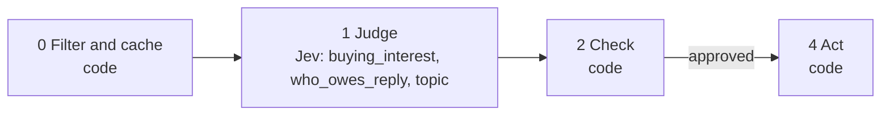

# 11 · Cold ICP conversations

The most valuable list in a LinkedIn archive is conversations that showed buying interest and then went quiet, especially where you owe the reply.

**Shape:** decision only. Request file: [`requests/11-cold-icp-conversations.json`](requests/11-cold-icp-conversations.json). Saved traces: [`responses/11-cold-icp-conversations.json`](responses/11-cold-icp-conversations.json).

## 0 · Filter and cache (code)

- Skip contacts on the suppression list.
- Send text that looks like an instruction to the model to a person.
- Quiet for quiet_days or less: skip. Code does the date arithmetic.
- Existing customer: skip.

Answer store. Fingerprint = questions + model + state; a stored answer is reused with no Jev call.

## 1 · Judge (Jev)

One request per record, all questions together.

| Question | Primitive | What it asks |
|---|---|---|
| `buying_interest` | Noul | At any point in `thread`, did the other person show interest in buying, evaluating or learning about what `me` offers? |
| `who_owes_reply` | Choice | Looking at the last message in `thread`, who should reply next? |
| `topic` | Choice | What is `thread` mainly about? |

## 2 · Check (code)

**Facts that overrule Jev:** `customer`, `fit`.

| Cutoff | Value |
|---|---|
| `quiet_days` | 30 |
| `min_fit` | 60 |
| `buying_interest` | 0.7 |

- topic is not sales_conversation: ignore.
- buying_interest below the cutoff: ignore.
- Fit score below min_fit: ignore. A missing fit score does not filter.
- Otherwise revive, with "I owe the reply" first.

**Nothing goes to a person.** Every result is a ranking or a label, not an action on someone.

## 3 · Write (LLM)

Not used. The decision is the output.

## 4 · Act (code)

| Action | What happens |
|---|---|
| `revive` | Add to the revive list. |
| `ignore` | Nothing. |
| `skip` | Nothing. |

Every record is logged with its input, answers, facts, the rule that decided, and the outcome.

## Results

Jev's answers are real, from `jev-1.13.0` on 2026-09-22. Replay them with no key: `npm run replay -- 11`.

**Jev judges.** The cases where the judgment is the point.

| Case | Jev said | Rule that decided | Action | Status |
|---|---|---|---|---|
| Went cold after a pricing question | buying_interest: 98% who_owes_reply: me (1.00) topic: sales_conversation (1.00) | `buying_interest` | `revive` | done |
| Networking that ended | buying_interest: 3% who_owes_reply: nobody (0.73) topic: networking (1.00) | `topic_networking` | `ignore` | done |
| Vendor pitching me, I didn't answer | buying_interest: 8% who_owes_reply: me (0.99) topic: pitch_to_me (0.99) | `topic_pitch_to_me` | `ignore` | done |
| Waiting on them | buying_interest: 88% who_owes_reply: them (1.00) topic: sales_conversation (1.00) | `buying_interest` | `revive` | done |

**Code decides or overrules.** The same inputs with different facts.

| Case | What code knows | Rule that decided | Action | Status |
|---|---|---|---|---|
| Quiet for only 12 days | `{"days_quiet":12,"fit":80}` | `not_quiet_yet` | `skip` | filtered |
| Buying interest, but a poor fit | `{"days_quiet":45,"fit":30}` | `low_fit` | `ignore` | done |

## What was learned

- who_owes_reply says "me" for the vendor pitch too, and correctly: technically you owe them a reply. topic is the question that removes it from the list.

## Limits

- Send only the last 6 to 10 messages of each thread.
- These are private conversations. Keep the export on your machine.
- No revive message is drafted. Writing one needs the thread text, which step 3 is not allowed to see yet.
