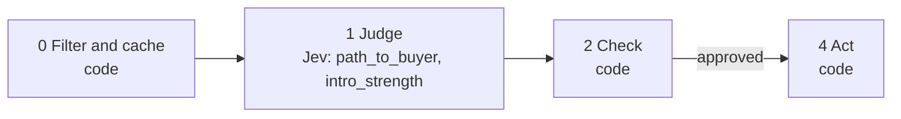

# 12 · Warm-intro finder

For any account you want to reach, the best first message comes through someone you already know. Code finds your connections at each target account. Jev judges how close each is to the buyer.

**Shape:** decision only. Request file: [`requests/12-warm-intro-finder.json`](requests/12-warm-intro-finder.json). Saved traces: [`responses/12-warm-intro-finder.json`](responses/12-warm-intro-finder.json).

## 0 · Filter and cache (code)

- Skip contacts on the suppression list.
- Send text that looks like an instruction to the model to a person.
- Code joins your connections to target accounts by company before anything is judged.

Answer store. Fingerprint = questions + model + state; a stored answer is reused with no Jev call.

## 1 · Judge (Jev)

One request per record, all questions together.

| Question | Primitive | What it asks |
|---|---|---|
| `path_to_buyer` | Choice | At the company in `target_account`, how is the person in `connection` related to the buyer described in `target_account.buyer`? |
| `intro_strength` | Score | How well placed is the person in `connection` to introduce us to the buyer in `target_account.buyer`? |

## 2 · Check (code)

**Facts that overrule Jev:** none. This playbook checks cutoffs only.

| Cutoff | Value |
|---|---|
| `never_messaged_cap` | 1 |

- Rank intro paths by intro_strength.
- A connection you never messaged is capped at never_messaged_cap, whatever the title says.

**Nothing goes to a person.** Every result is a ranking or a label, not an action on someone.

## 3 · Write (LLM)

Not used. The decision is the output.

## 4 · Act (code)

| Action | What happens |
|---|---|
| `intro_path` | Best path per account. |

Every record is logged with its input, answers, facts, the rule that decided, and the outcome.

## Results

Jev's answers are real, from `jev-1.13.0` on 2026-09-22. Replay them with no key: `npm run replay -- 12`.

**Jev judges.** The cases where the judgment is the point.

| Case | Jev said | Rule that decided | Action | Status |
|---|---|---|---|---|
| Connection is the CRO | path_to_buyer: is_the_buyer (0.98) intro_strength: 2.94 of 3 | `intro_strength` | `intro_path` | done |
| Connection is an AE on the buyer's team | path_to_buyer: same_team (0.96) intro_strength: 1.87 of 3 | `intro_strength` | `intro_path` | done |
| Connection is the founder | path_to_buyer: leads_the_buyer (0.85) intro_strength: 2.38 of 3 | `intro_strength` | `intro_path` | done |
| Connection is a data engineer | path_to_buyer: other_team (1.00) intro_strength: 0.67 of 3 | `intro_strength` | `intro_path` | done |

**Code decides or overrules.** The same inputs with different facts.

| Case | What code knows | Rule that decided | Action | Status |
|---|---|---|---|---|
| The CRO, but you never messaged them | `{"message_count":0}` | `never_messaged` | `intro_path` | done |

## What was learned

- Measured on one real export with code only, no model: 130 of the 299 companies one person follows had at least one of their connections working there, 680 people in all. The warm paths exist; nobody had listed them.
- The founder case came back with low confidence on intro_strength, which is fair. A co-founder knows the head of sales; whether they would make the intro is a human question.

## Limits

- Matching on company name misses "Acme" against "Acme Inc." unless you normalise it or match on domain.
- The strength of the relationship is not in the title. That is why `message_count` overrules Jev.
