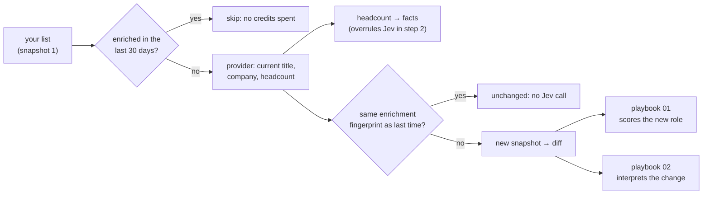

# 13 · Any lead list, and keeping it fresh with enrichment

This one has no questions of its own. It is how records and facts get into the playbooks: any list with a job title and a company becomes records for [playbook 01](01-linkedin-network-icp.md), each detected job change becomes a record for [playbook 02](02-job-change-interpretation.md), and enrichment writes the hard data that step 2 checks Jev against.

In the architecture it sits entirely in the code layers: step 0 on the way in, and the facts store.



## Score a list

```bash
npm run score -- ~/Downloads/apollo-export.csv
```

Columns are found by common names: `Title` / `Job Title` / `Position`, `Company` / `Company Name` / `Account`, `LinkedIn URL`, `Email`, `First Name` / `Last Name` or `Name`. Each person is identified by LinkedIn URL, then email, then name and company. Use a separate database per list so they do not mix:

```bash
JEV_GTM_PLAYBOOK_DB=data/apollo.db npm run score -- ~/Downloads/apollo-export.csv
```

## Keep it fresh with enrichment

Titles change, and a list goes stale in months. `enrich` asks a data provider for each person's current title and company and stores the result as a new snapshot, so the normal change detection runs on it. Only the people whose role actually changed are sent to Jev.

```bash
npm run enrich -- prospeo --limit 200 --max-age-days 30 --min-fit 60
```

| Provider | Key in `.env` | Needs | Docs |
|---|---|---|---|
| Prospeo | `PROSPEO_API_KEY` | LinkedIn URL, or name + company | [enrich-person](https://prospeo.io/api-docs/enrich-person) |
| LeadMagic | `LEADMAGIC_API_KEY` | LinkedIn URL | [profile-search](https://leadmagic.io/docs/api-reference/profile-search) |
| BlitzAPI | `BLITZ_API_KEY` | LinkedIn URL | [person enrichment](https://docs.blitz-api.ai/api-reference/people-enrichment/person-enrichment.md) |
| MoltSets | `MOLTSETS_API_KEY` | LinkedIn URL | [reverse LinkedIn lookup](https://developer.moltsets.com/api-reference/reverse-lookups/reverse-linkedin-lookup) |

## What enrichment adds to the sandwich

| What the provider returns | Where it goes | What it changes |
|---|---|---|
| Current title and company | A new snapshot | A changed title is a job change: playbook 01 re-scores the person and playbook 02 interprets the move |
| Company description | The person's record, inside the state Jev sees | `company_fit` can answer something other than "cannot tell" |
| Headcount and company domain | The facts store, keyed by domain | In step 2, code compares the number to the size range and that replaces Jev's `company_fit` |

The third row is what makes enrichment part of the sandwich: the headcount is hard data, so it wins over a probability.

## Three things keep it cheap

1. **The enrichment fingerprint:** a hash of the title, company and description the provider returned. If it matches last time, nothing changed and Jev is never called.
2. **The answer store:** playbook 01's fingerprint is the questions, the model and the state. The person is not in the state, so two people with the same role at the same company share one answer.
3. **Credits are spent carefully:** `--max-age-days` never buys the same person twice within the window, `--min-fit` spends credits on people who already fit, and `--limit` caps each run.

## Limits

- The adapters follow each provider's public API docs and are covered by offline tests with the documented response shapes. They have not been run against every live API.
- Only Prospeo's adapter returns a headcount, so only Prospeo feeds the headcount fact today.
- Providers differ in coverage and cost. Run 50 records through two and compare before committing to one.
- Only title, company and company description reach Jev. The provider sees whatever you send it (usually the LinkedIn URL), under that provider's terms.
