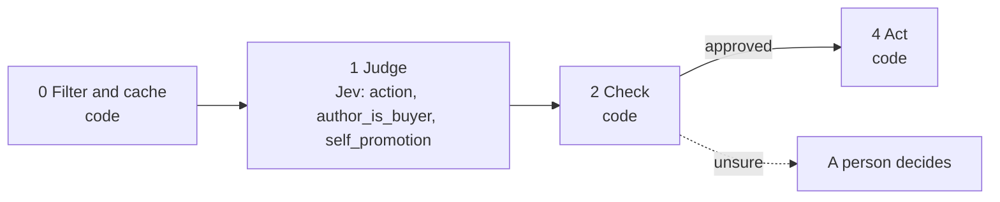

# 14 · Social signal triage

People post their problems in public. Keyword alerts find those posts but bury them under vendors' listicles and job ads that use the same words. This playbook decides whether to engage, monitor or ignore.

**Shape:** decision only. Request file: [`requests/14-social-signal-triage.json`](requests/14-social-signal-triage.json). Saved traces: [`responses/14-social-signal-triage.json`](responses/14-social-signal-triage.json).

## 0 · Filter and cache (code)

- Skip contacts on the suppression list.
- Send text that looks like an instruction to the model to a person.
- Job ads: ignore.
- Posts by a competitor: ignore.
- Posts by a customer: route to the account owner.

Answer store. Fingerprint = questions + model + state; a stored answer is reused with no Jev call.

## 1 · Judge (Jev)

One request per record, all questions together.

| Question | Primitive | What it asks |
|---|---|---|
| `action` | Choice | Given `what_we_sell`, what should we do about `post`? |
| `author_is_buyer` | Noul | Does `post` suggest its author would be the one to buy `what_we_sell`? |
| `self_promotion` | Noul | Is `post` mainly promoting the author's own product, service or content? |

## 2 · Check (code)

**Facts that overrule Jev:** `competitor`, `customer`.

| Cutoff | Value |
|---|---|
| `self_promotion` | 0.8 |
| `action_confidence` | 0.6 |
| `author_is_buyer` | 0.6 |

- self_promotion at or above the cutoff: ignore.
- engage with author_is_buyer at or above its cutoff: engage.
- Otherwise ignore stays ignore and the rest is monitor.

**Goes to a person when:**

- action confidence below the cutoff.

## 3 · Write (LLM)

Not used. The decision is the output.

## 4 · Act (code)

| Action | What happens |
|---|---|
| `engage` | A person replies. Nothing is auto-posted. |
| `monitor` | Watch. |
| `ignore` | Nothing. |
| `review` | A person decides. |
| `route_to_owner` | Hand to the account owner. |

Every record is logged with its input, answers, facts, the rule that decided, and the outcome.

## Results

Jev's answers are real, from `jev-1.13.0` on 2026-09-22. Replay them with no key: `npm run replay -- 14`.

**Jev judges.** The cases where the judgment is the point.

| Case | Jev said | Rule that decided | Action | Status |
|---|---|---|---|---|
| Founder asking for help | action: engage (1.00) author_is_buyer: 83% self_promotion: 5% | `buyer_with_a_problem` | `engage` | done |
| A vendor's listicle | action: ignore (0.94) author_is_buyer: 12% self_promotion: 97% | `self_promotion` | `ignore` | done |
| Industry discussion | action: engage (0.36) author_is_buyer: 50% self_promotion: 6% | `low_confidence` | `review` | needs_person |
| Job posting | not asked | `job_ad` | `ignore` | filtered |

**Code decides or overrules.** The same inputs with different facts.

| Case | What code knows | Rule that decided | Action | Status |
|---|---|---|---|---|
| Posted by a competitor | `{"domain:rival.test":{"competitor":true},"domain":"rival.test"}` | `competitor` | `ignore` | filtered |

## What was learned

- The miss, and why the cutoff matters. "Is outbound dead?" was expected to be monitor. First run: engage at 0.66. After tightening engage to "a specific problem of their own": still engage, but at 0.36. The answer stayed wrong and the confidence dropped below the cutoff, so it goes to a person.

## Limits

- Collect posts through each platform's API or official exports, within its terms.
- A person writes and posts every reply. Nothing is drafted or auto-posted.
- One saved case is a known miss: "Is outbound dead?" came back as engage at 0.36. The confidence cutoff is what sends it to a person.
