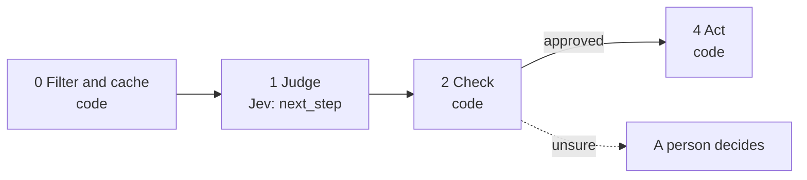

# 15 · Pick the follow-up

Sequences send the same follow-up to everyone whatever they said. This playbook reads the thread and picks which of your own templates fits next, or says stop. Jev chooses and you wrote every word, so nothing is generated.

**Shape:** decision only. Request file: [`requests/15-pick-the-follow-up.json`](requests/15-pick-the-follow-up.json). Saved traces: [`responses/15-pick-the-follow-up.json`](responses/15-pick-the-follow-up.json).

## 0 · Filter and cache (code)

- Skip contacts on the suppression list.
- Send text that looks like an instruction to the model to a person.
- Playbook 03 runs first, so suppressed contacts never arrive.
- Code counts touches and days; Jev is never asked to.

Answer store. Fingerprint = questions + model + state; a stored answer is reused with no Jev call.

## 1 · Judge (Jev)

One request per record, all questions together.

| Question | Primitive | What it asks |
|---|---|---|
| `next_step` | Choice | Given `thread`, which of our follow-ups in `templates` should we send next, or should we stop? |

## 2 · Check (code)

**Facts that overrule Jev:** `suppressed`.

| Cutoff | Value |
|---|---|
| `max_touches` | 4 |
| `next_step_confidence` | 0.6 |

- stop is always honoured, however sure.
- At max_touches or more, stop, whatever Jev picked.
- Otherwise send the chosen template, unchanged.

**Goes to a person when:**

- answer_manually.
- next_step confidence below the cutoff.

## 3 · Write (LLM)

Not used. The decision is the output.

## 4 · Act (code)

| Action | What happens |
|---|---|
| `send:<template>` | Send your own template. |
| `stop` | Stop the sequence. |
| `human` | A person decides. |

Every record is logged with its input, answers, facts, the rule that decided, and the outcome.

## Results

Jev's answers are real, from `jev-1.13.0` on 2026-09-22. Replay them with no key: `npm run replay -- 15`.

**Jev judges.** The cases where the judgment is the point.

| Case | Jev said | Rule that decided | Action | Status |
|---|---|---|---|---|
| No reply after the first email | next_step: bump (0.72) | `next_step` | `send:bump` | done |
| Asked how it works | next_step: case_study (0.46) | `low_confidence` | `human` | needs_person |
| Specific question | next_step: answer_manually (0.91) | `answer_manually` | `human` | needs_person |
| Three unanswered follow-ups | next_step: breakup (0.58) | `low_confidence` | `human` | needs_person |
| Declined | next_step: stop (0.97) | `stop` | `stop` | done |

**Code decides or overrules.** The same inputs with different facts.

| Case | What code knows | Rule that decided | Action | Status |
|---|---|---|---|---|
| Fifth touch | `{"touches":4}` | `max_touches` | `stop` | done |

## What was learned

- This is select instead of generate: Jev picks one of your own templates, so nothing is written by a model.
- All five saved cases were right. Two came back with low confidence, and those are the threads where the next move is a judgment call.

## Limits

- Run playbook 03 first so opt-outs are suppressed before this playbook sees the thread.
- Put `days_ago` in the state and `touches` on the record. Jev cannot count or compare dates.
- On live Jev, "Three unanswered follow-ups" moved from 0.58 to above the 0.6 cutoff. That cutoff sits on top of a real case; tune it on your own threads.
